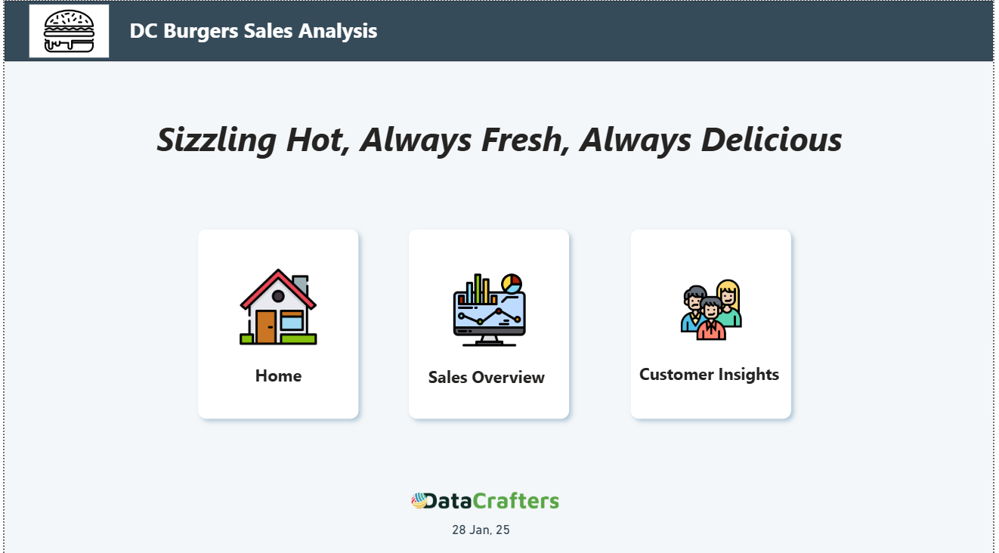
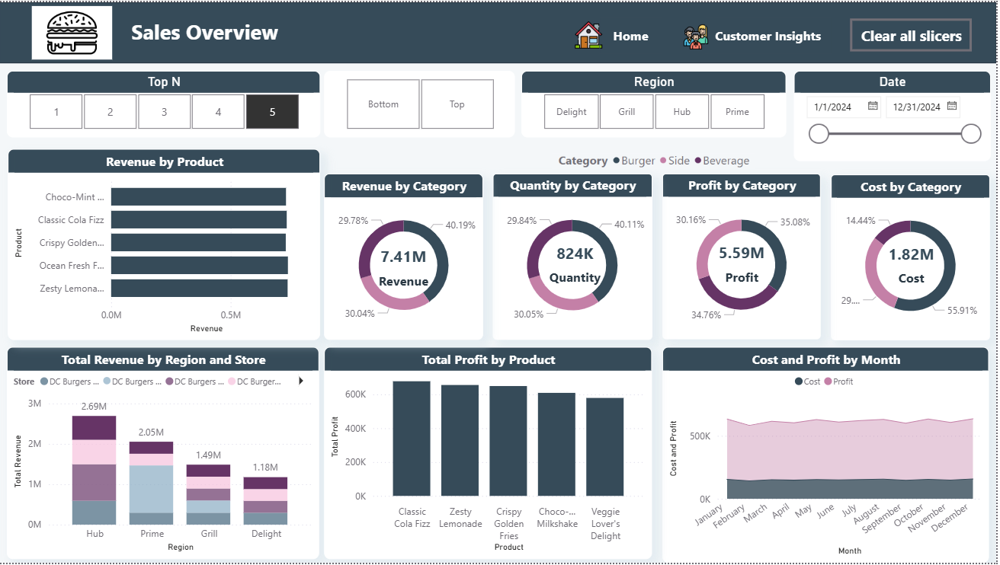
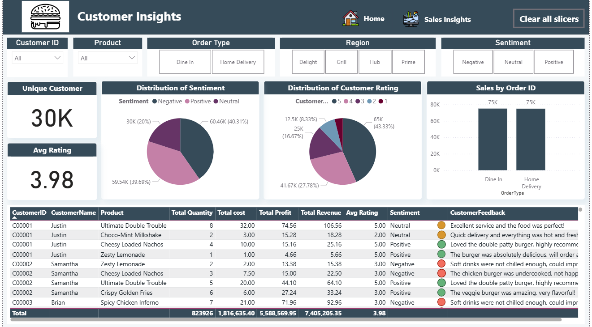

Power BI Report: DC Burgers Sales Analysis

Overview
--

The Power BI report titled "DC Burgers Sales Analysis" provides detailed insights into customer behavior, sales trends, and overall performance for DC Burgers. The report is structured into three main pages for seamless navigation and comprehensive data exploration:

Home Page

Sales Overview

Customer Insights

Page Details

1. Home Page

The Home Page serves as the entry point for the report. It features:

Title and Branding: Highlighting "DC Burgers Sales Analysis" with the tagline "Sizzling Hot, Always Fresh, Always Delicious".

Navigation Buttons: Easy access to the three key sections:

Home

Sales Overview

Customer Insights

Footer: Includes the branding "DataCrafters" and the report date, ensuring professionalism and clarity.

2. Sales Overview

This page provides a comprehensive view of sales metrics and key performance indicators (KPIs). Key components include:

Filters: Options to slice data by:

Top N products

Region (Delight, Grill, Hub, Prime)

Date range

Product category (Burger, Side, Beverage)

Visuals:

Revenue by Product: Bar chart showing revenue contributions of top products.

Revenue, Quantity, Profit, and Cost by Category: Donut charts illustrating category-wise breakdowns.

Total Revenue by Region and Store: Stacked bar chart showing revenue distribution.

Total Profit by Product: Bar chart comparing profits for top products.

Cost and Profit by Month: Area chart showcasing monthly trends.

3. Customer Insights

This page offers an in-depth look into customer behavior and satisfaction metrics. Key highlights:

Filters:

Customer ID

Product

Order Type (Dine In, Home Delivery)

Region

Sentiment (Positive, Neutral, Negative)

KPIs:

Unique Customers: Total unique customers served (30K).

Average Rating: Overall customer satisfaction rating (3.98).

Visuals:

Distribution of Sentiment: Pie chart breaking down customer sentiments.

Distribution of Customer Rating: Pie chart showing the spread of ratings (1 to 5).

Sales by Order ID: Bar chart comparing dine-in and home delivery sales.

Customer Feedback Table:

Detailed records of customer transactions, ratings, sentiment, and feedback.

Key Metrics and Highlights

Revenue: $7.41M across all categories.

Profit: $5.59M, with Burgers as the top-performing category.

Customer Sentiment: 40.31% positive, 39.69% neutral, and 20% negative.

Top Products: Classic Cola Fizz, Zesty Lemonade, and Crispy Golden Fries lead in profitability.
